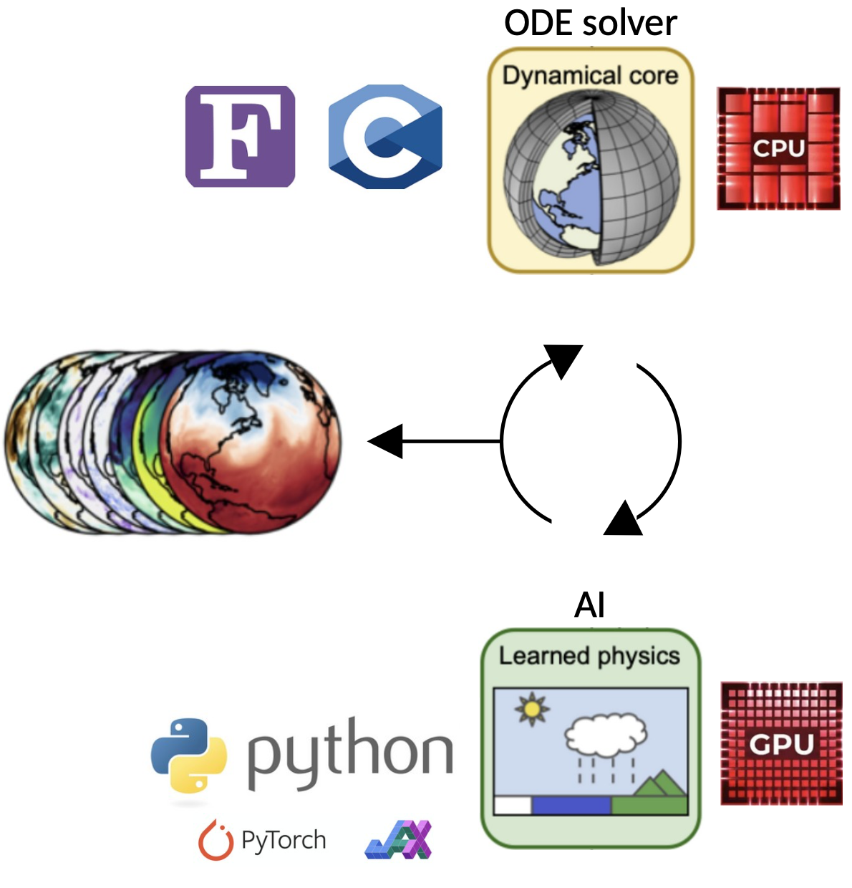
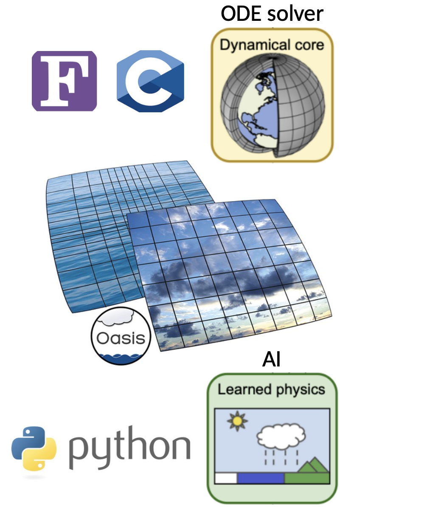

Why Eophis ?
============

.. autosummary::
   :toctree: generated

A bit of context
----------------

Eophis development takes place in the context of combinating Python models with geoscientific legacy solvers written in low-level abstraction languages as Fortran or C/C++.

Typical applications include:
    - Machine Learning (ML) / Physic-based hybrid modelling
    - Quick deployment of fast-evolving high-level libraries in stable low-level environment
    - Testing prototypal code before translation for official merging

Interfaces are here required to make both entities to coexist. Beyond the heterogeneity of programming languages, the interface may also be compulsory to couple a CPU-optimized code with a GPU-optimized code. ML / Physics hybridation is a complete representative example of all these needs.

The question is adressed here through the strategy of creating pipes between Fortran/C and Python scripts executed seperately. In this framework, both scripts are intended to exchange generic formatted data (typically arrays) through a communicating library.

Advantages of this approach are many:
    - Flexibility to fill each scripts of any content with mininal bindings
    - Execution of each scripts in different processing architectures
    - Python scripts easily shareable
    - Each scripts are up-to-date with its own environment

`OASIS <https://oasis.cerfacs.fr/en/>`_ is a Fortran coupling library that allows to perform exchanges of 2D/3D fields with/out interpolation between coupled executables and appears here to be a good candidate. Indeed, last releases provided C and Python APIs, allowing coupling of heterogeneously written codes. Most of all, OASIS is already widely deployed in the climate modeling community codes.

.. note:: The main motivation is to use OASIS in a way that a geoscientific model would exchange data with an external Python script that should contain an OASIS interface and modeling / ML material.

Difficulties
------------

Let's say that we developed a Python model that takes some geophysical fields as inputs. We wish to deploy it within a Fortran geoscientific model. Assuming OASIS is already configured in the physical side, remaining work is to implement and configure the OASIS interface in the Python script, write the OASIS namelist and manage connexions between sent/received data and inputs/ouputs of the Python model.

We can highlight here several points:
    - A good understanding of OASIS and its namelist is required to set up the coupling. Reccurent errors may occur with non OASIS-experts.
    
    - All of these steps should be repeated and adapted for each coupling situation and Python scripts, making them tedious.
    
    - Aimed OASIS usage in this case requires both simplified and complexified operations compared to the typical use, making standard learning of OASIS unadapted.

.. note:: Eophis aims to facilitate the deployment of Python models through OASIS by orchestrating all the coupling operations in the Python side with a simplified API.

Storytelling
------------

The above presented context may be quickly summarized in this way: *we wish to deploy Python code within geoscientific models*.

Let's reformulate this in a more figurative way: *we wish to populate earth with snakes*.
What is more natural than the parent of all snakes to fulfill this objective ?

Here comes **Eophis**, name of the oldest known snake ancestra (2023).
