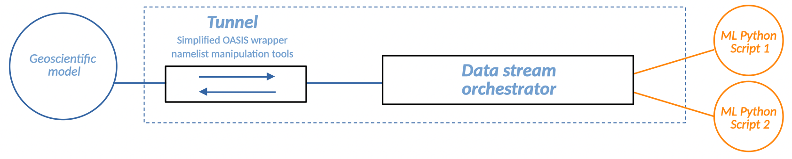
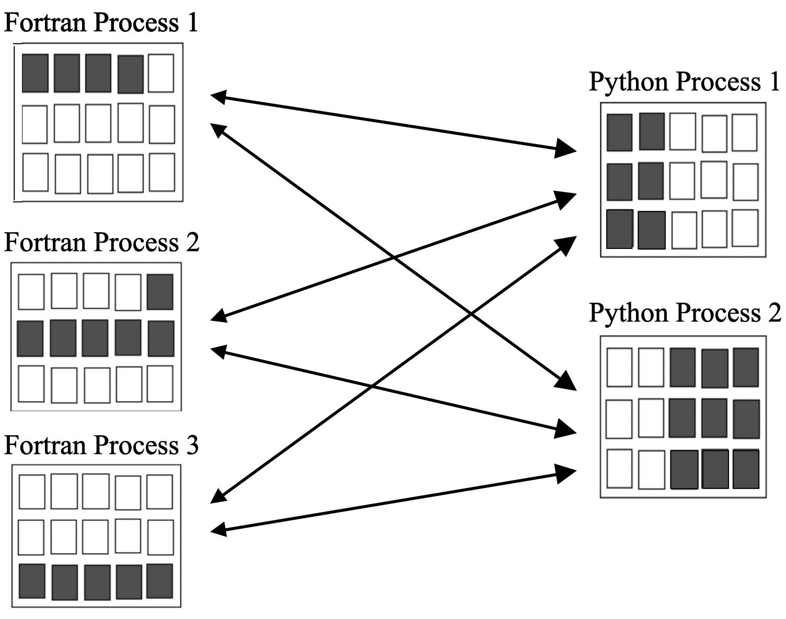
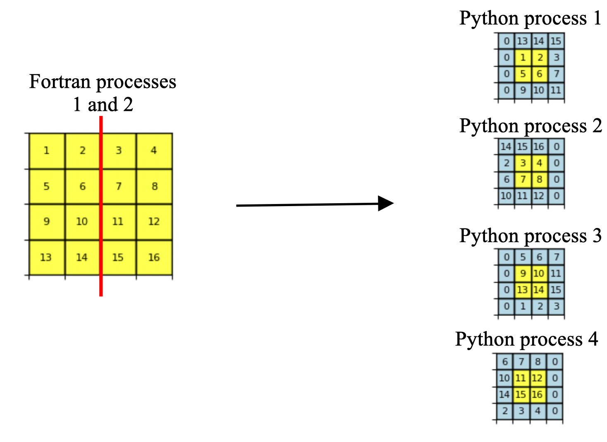
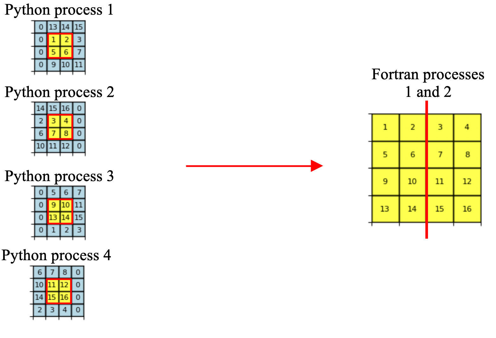
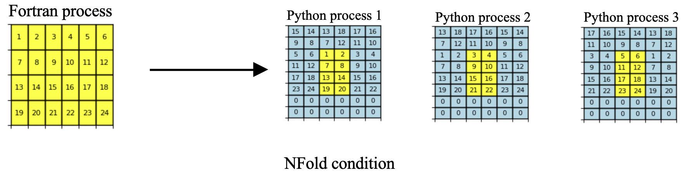
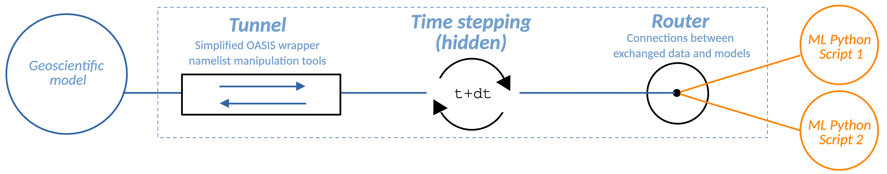

Objects
=======

.. autosummary::
   :toctree: generated

Eophis abstractions are presented here. The aim is to explain their roles and functionalities but not to demonstrate how to use them. See **Usage** section with coding examples for this.

Coupling
--------

Tunnel
~~~~~~

The Tunnel represents the gate towards a coupled geoscientific model.

It gathers informations on:
    - global and local grids on which coupled fields are discretized.
    - exchanges themselves, as communication frequencies, corresponding in/out fields names and associated grids.

OASIS objects and commands to execute the sending and reception of fields are encapsulated in the Tunnel.

.. note:: Tunnel may be summarized with the following thought: **I want to open a gate between my codes to exchange these fields, N times, on this grid**.

Grid
~~~~

The fields that are sent or received by each coupled script are usually scattered among their executing processes.
OASIS needs to know the local grid sizes expressed with global indexes to perform optimized partition-to-partition communications.
If global sizes are different, OASIS can also perform interpolation from a grid to another.

In the Eophis framework, it is considered that the coupled grids are identical on both side. Defining the local partition is still required anyway to set up communications.
This operation is done by the Grid object. Global 2D longitude and latitude sizes are the minimal required attributes to create a Grid. Third dimension for depth is specified in Tunnel since OASIS considers that sending a 3D field is like communicating N-level times on the same 2D partition.

**Halos**

For some operations, such as differential calculus or in Convolutional Neural Networks, it is necessary to know the neighboring cells of the local grid being processed.
When local grids are located at the edges of global grid, boundary conditions must be specified to determine the values of cells that cross the boundary.
This requirement remains true even if global grid is not distributed across multiple processes.

Thus, grid cells may be divided in two parts:
    - *real cells*: cells strictly contained in the local grid (yellow)
    - *halo cells*: potential extra cells outside the local grid containing neighboring values (blue)

In classic OASIS coupling, communications only involve real cells, as coupled geoscientific models have their own internal communication system to construct halos.
With some tricks and intermediate reconstruction operations, Grid can obtain fields with extra halos cells directly from OASIS communications. This spares the need to create an internal communication system for Eophis, killing two birds with one stone by combining halo construction with field exchanges.
When sending a field back, Grid automatically removes the halo cells.

Grid definition can include an additionnal halo size attribute. A zero halo size corresponds to classic OASIS communications.
Boundary conditions can also be specified during Grid definition to determine the value of halo cells that cross the global grid edges.

Three types of boundary conditions are available:
    - *close*: halos cells are filled with zeros (horizontal dimension in above examples)
    - *cyclic*: halos cells are filled with periodic values (vertical dimension in above examples)
    - *NFold*: vertical dimension top line is folded on itself, see `section 7.2 of this documentation <https://zenodo.org/records/8167700>`_

If not specified, default halo size and boundary conditions are zero and *close*. Note that boundary conditions are useless if Grid is defined without halos.

.. warning :: *NFold* (NorthFold) imposes *close* condition for second dimension bottom line. It is used by `NEMO <https://www.nemo-ocean.eu/>`_ on three-polar ORCA grids to model global ocean circulation. *NFold* condition requires to specify folding point (T or F) and grid point type (T,U,V or F).

.. note:: Pre-defined commonly used grids with/out halos are stored in Eophis sources. A pre-defined Grid is referred to as Domains in Eophis.

Model
~~~~~

Model refers to the functions in the Python script towards which the exchanged fields should be sent or obtained.

A Model must fit the following requisites:
    - be a callable function that takes at least N numpy arrays as inputs (those are the data received from the Tunnel).
    - return M ``None`` for the M awaited outputs if at least one of the N inputs is ``None``.
    - inputs may be freely formatted and transformed, but outputs must be formatted as numpy arrays whose dimensions correspond to those awaited by the Tunnel grid.

Loop
----

In its standard use, OASIS needs to be aware of the temporal advancement of both coupled scripts to synchronize exchanges in time. In the context of coupling a Python script to use functions (like ML models), time is not computed. Thus, it is needed to mirror the temporal advancement of the coupled geoscientific code to keep synchronicity of exchanges.

Loop is an object that emulates time advancement with a hidden time stepping procedure. It only needs to know the total simulation time and to be associated with a Tunnel.

When Loop starts, all receptions and sendings of the associated Tunnel are temporally orchestrated.

.. Warning:: Time loop won't start if all the Static exchanges (see **Frequency** section) of the associated Tunnel are not done.

Frequency
~~~~~~~~~

Depending on the setup, fields can be exchanged once or repeatedly as the Loop emulates time advancement. Different communication frequencies can be configured for each field.

Two types of frequency are available:
    - Static: sending or receiving a field is done manually ONCE and will be ignored by the Loop. This is useful to obtain non-evolving data as masks or metrics.
    - Non-static: fields will be exchanged at the prescribed frequency (expressed in seconds). Manual sending or receiving are disabled for those fields.

.. Note:: Static frequency is a pre-defined Eophis parameter. Pre-defined regular frequencies are also available.

Router
------

The coupling is now set up with the Tunnel and the exchanges are automated by the Loop. Received fields need then to be sent towards the desired Model inputs and outputed fields need to be pushed in the correct Tunnel for sending back. This pipeline is intended to change with the user wanted realization.

Router is a tool whose role is to offer simplicity and flexibility for setting up connexions between the exchanged data and the inputs / outputs of the Models.

Miscellaneous
-------------

Above objects are enough to build a basic coupling workflow. Extra useful tools are yet available in the Eophis libary and are presented below.

Namelists
~~~~~~~~~

Geoscientific Fortran / C codes often use namelists to configure the physical context of the simulation. Important informations as time step are stored within.

User is free to hard code the physical context in the Python script. Nevertheless, it is more robust to obtain these informations where the coupled physical code does.

Thus, a tool to read formatted namelist (only Fortran for now) and easily access its content is available in Eophis.

Current implementation does not allow to modify and write a namelist. Update physical namelist in accordance with coupling context could spare user time and errors. This feature is under development for next releases.

.. note:: OASIS namelist *namcouple* is a particular case. Only one OASIS namelist is required for all couplings and needs to be correctly written to avoid errors hard to track. Every action related to Tunnel configuration is supervised by *namcouple*. For all these reasons, object Namcouple is a protected unique entity with its own API.

    It is possible to bring its own *namcouple* and use Eophis to check its content in accordance with the desired coupling context.

Logs
~~~~

Two log files ``eophis.out`` and ``eophis.err`` for regular and warning/error messages are automatically created and filled when importing Eophis package. The API to use them is accessible to the user.

Logs allow three message types:
    - Info: regular outputs in ``eophis.out``
    - Warning: described in ``eophis.err``. Indicates in ``eophis.out`` that a warning occured
    - Abort: Proceed as warning messages, then kill the execution
