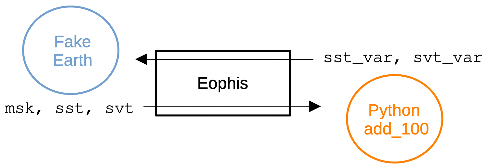
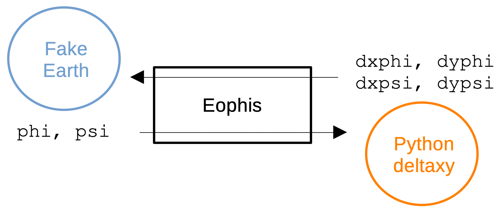

Tests
=====

A collection of operating tests for continuous integration and demonstration purposes is provided in the repository. This section describes what they are trying to achieve and how to use them.

`Write and Couple <https://github.com/meom-group/eophis/tree/main/tests/write_and_couple>`_
-------------------------------------------------------------------------------------------

A surrogate geoscientific code with an hard-coded OASIS interface is emulated by ``toy_earth.py``.
The script advances in time in accordance with parameters provided in the Fortran namelist ``earth_namelist``.
``models.py`` contains a dummy model ``add_100()`` that we wish to deploy within Toy Earth.

Toy Earth intends to send:
    - one 2D time-evolving field ``sst``, with a hourly frequency, on grid ``(720,603)``
    - one 3D time-evolving field ``svt``, with a daily frequency, on grid ``(720,603,3)``
    - one fixed metric field ``msk``, only once, on same ``sst`` grid
and to receive from the Python model:
    - one field ``sst_var``, computed from ``sst``, with same dimensions
    - one field ``svt_var``, computed from ``svt``, with same dimensions

Eophis script ``main.py`` aims to write coupling namelist, configure OASIS interface for ``models.py``, and orchestrate connexions between exchanged data and ``add_100()``.

In addition to ``add_100()``, Toy Earth adds 0.2 to ``sst`` and 0.5 to ``svt`` every time step. Given the number of time steps and exchanges, final values are theoretically known. Test is successful if final ``sst`` and ``svt`` correspond to theory, meaning that coupling and exchanges have been performed correctly, with right frequencies.

It illustrates :
    - Preproduction and Production modes
    - Tunnel configuration and registration for regular and static exchanges of 2D/3D fields
    - Fortran namelist manipulation
    - Writing of coupling namelist
    - Tunnels opening
    - Assembly of a Loop and a Router
    - Model required global structure
    - Static exchange and start of time emulation for regular exchanges

Following commands run the test (number of executing processes may be changed in *Makefile*):
    - `make` : execute commands below
    - `make clean` : remove working files
    - `make preprod` : execute eophis in preproduction mode to write coupling namelist
    - `make prod` : execute eophis in production mode for coupling with dummy earth system script

.. code-block:: bash

    cd tests/write_and_couple
    make
    python3 ./main.py --exec preprod
    mv eophis.out preprod_eophis.out
    mpirun -np 1  python3 ./toy_earth.py : -np 1  python3 ./main.py --exec prod
    TEST SUCCESSFUL
    END OF WRITE AND COUPLE TEST

`Halo Decomposition <https://github.com/meom-group/eophis/tree/main/tests/halo_decomposition>`_
-----------------------------------------------------------------------------------------------

A surrogate geoscientific code with an hard-coded OASIS interface is emulated by ``toy_earth.py``.
The script advances in time in accordance with parameters provided in the Fortran namelist ``earth_namelist``. ``models.py`` contains a dummy model ``deltaxy()`` that computes first order discrete differences along first and second axis.

Differences imply to know neighboring cells. Those will be missing at boundaries, especially if ``models.py`` is scattered among processes. Fields need to be received on the model side with at least 1 extra halo cell to compute correct differences. It is also required to determine the values of the halos located over the edges of the global grid.

Thus, Toy Earth intends to send every time step:
    - ``psi``, on Arakawa C-grid V points, with size ``(10,10,3)``, cyclic/NFold conditions and 1 halo
    - ``phi``, on a standard grid, with size ``(10,10,2)``, closed/cyclic conditions and 2 halos
and to receive from the Python model:
    - ``dxpsi`` and ``dypsi``, results from ``deltaxy(psi)``, defined on same ``psi`` grid
    - ``dxphi`` and ``dyphi``, results from ``deltaxy(phi)``, defined on same ``phi`` grid

In reality, Toy Earth is supposed to send/receive real cells only, without halos. Eophis goal here is to achieve exchanges with correct automatic reconstruction and rejection of halos. Differences are also computed in Toy Earth and compared with returned results. Test fails if results do not match.

It illustrates :
    - Definition of user-defined grids with halos
    - Definition of grids with different boundary conditions
    - Definition of exchanges with different grids within the same Tunnel

Following commands run the test (number of running CPUs may be changed in *Makefile*):
    - `make` : execute commands below
    - `make clean` : remove working files
    - `make preprod` : execute eophis in preproduction mode to write coupling namelist
    - `make prod` : execute eophis in production mode for coupling with dummy earth system script

.. code-block:: bash

    cd tests/halo_decomposition
    make
    python3 ./main.py --exec preprod
    mv eophis.out preprod_eophis.out
    mpirun -np 1  python3 ./toy_earth.py : -np 1  python3 ./main.py --exec prod
    TEST SUCCESSFUL
    END OF HALO DECOMPOSITION TEST

`Toy Earth <https://github.com/meom-group/eophis/tree/main/tests/toy_earth>`_
-----------------------------------------------------------------------------

A surrogate geoscientific code with an hard-coded OASIS interface is emulated by ``toy_earth.py``.
The script reads the ``namcouple`` and ``eophis_nml`` files generated during preproduction phase. From those information, Toy Earth initializes the right number of arrays with right shapes, following main Eophis script.
Finally, the script advances in time and perform the exchanges of arrays, according to the defined coupling context.

.. important ::
    
    In fewer words, Toy Earth adapt its behavior to fit the Eophis main script. Purpose of this test case is to isolate Eophis script to assist in testing and tracking bugs without deploying a whole geophysical model.

Prepare your test case:
    - Copy the Eophis main script and Python model to couple in Toy Earth directory
    - Copy any additional material required for the test case

Following commands run the custom test (number of running CPUs may be changed in *Makefile*):
    - `make` : execute commands below
    - `make clean` : remove working files
    - `make preprod` : execute eophis in preproduction mode to write coupling namelist
    - `make prod` : execute eophis in production mode for coupling with dummy earth system script

Here is an example of Toy Earth used with Halo Decomposition Eophis scripts. Note here that Toy Earth is a response to the defined coupling context to test its validity, it won't check what Halo Decomposition test case is supposed to achieve:

.. code-block:: bash

    cd tests/toy_earth
    # Prepare test case
    cp ../halo_decomposition/main.py  .
    cp ../halo_decomposition/models.py  .
    cp ../halo_decomposition/earth_namelist  .
    # Run test case
    make
    python3 ./main.py --exec preprod
    mv eophis.out preprod_eophis.out
    mpirun -np 1  python3 ./toy_earth.py : -np 1  python3 ./main.py --exec prod
    END OF TOY EARTH TEST

.. warning::
    Although Toy Earth test case is designed to adapt with any Eophis script, user specific features might prevent Toy Earth reaching end of execution, which does not necessarily mean failure. Check content of Eophis and Toy Earth logs. ``eophis.out`` should contains lines like these:
    
    .. code-block :: bash
    
        cat eophis.out
        # [...]
        Iteration 982: 1177200s -- 13 days, 15:00:00
           Treating sst received through tunnel TO_EARTH
           Sending back sst_var through tunnel TO_EARTH
        Iteration 985: 1180800s -- 13 days, 16:00:00
           Treating sst received through tunnel TO_EARTH
           Sending back sst_var through tunnel TO_EARTH
   
        
    and ``earth_log`` like these:
    
    .. code-block :: bash
    
        cat earth.log
        # [...]
        INFO:root:  Ite 563:
        INFO:root:    Sending sst - E_OUT_0
        INFO:root:    Receiving sst_var - E_IN_0
        INFO:root:  Ite 564:
        INFO:root:    Sending sst - E_OUT_0
        INFO:root:    Receiving sst_var - E_IN_0
