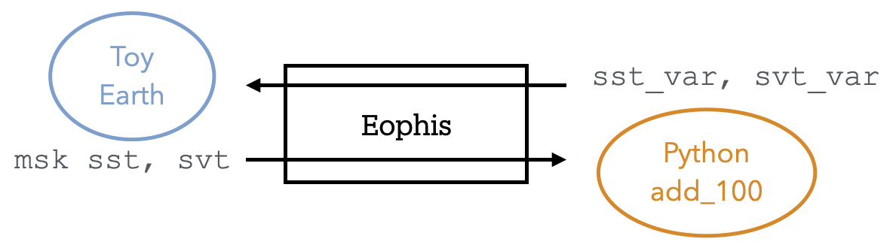
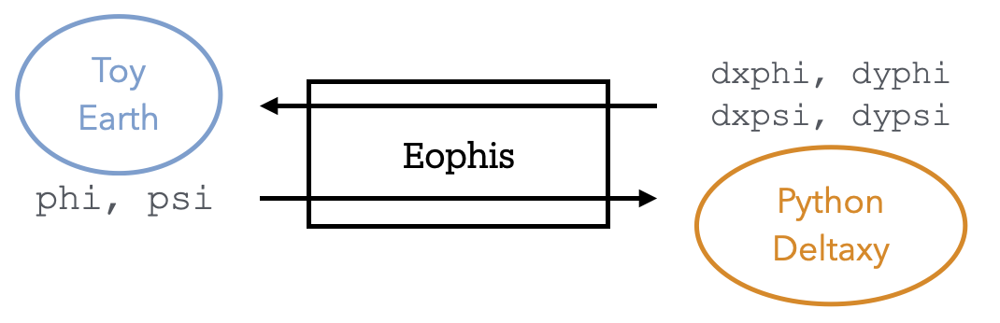

Tests
=====

A collection of operating tests for continuous integration and demonstration purposes is provided in the repository. This section describes what they are trying to achieve and how to use them.

`Write and Couple <https://github.com/meom-group/eophis/tree/main/tests/write_and_couple>`_
-------------------------------------------------------------------------------------------

A surrogate geoscientific code with an hard-coded OASIS interface is emulated by ``fake_earth.py``.
The script advances in time in accordance with parameters provided in the Fortran namelist ``earth_namelist``.
``models.py`` contains a dummy model ``add_100()`` that we wish to deploy within Fake Earth.

Fake Earth intends to send:
    - one 2D time-evolving field ``sst``, with a hourly frequency, on grid ``(720,603)``
    - one 3D time-evolving field ``svt``, with a daily frequency, on grid ``(720,603,3)``
    - one fixed metric field ``msk``, only once, on same ``sst`` grid
and to receive from the Python model:
    - one field ``sst_var``, computed from ``sst``, with same dimensions
    - one field ``svt_var``, computed from ``svt``, with same dimensions

Eophis script ``main.py`` aims to write coupling namelist, configure OASIS interface for ``models.py``, and orchestrate connexions between exchanged data and ``add_100()``.

In addition to ``add_100()``, Fake Earth adds 0.2 to ``sst`` and 0.5 to ``svt`` every time step. Given the number of time steps and exchanges, final values are theoretically known. Test is successful if final ``sst`` and ``svt`` correspond to theory, meaning that coupling and exchanges have been performed correctly, with right frequencies.

It illustrates :
    - Preproduction and Production modes
    - Tunnel configuration and registration for regular and static exchanges of 2D/3D fields
    - Fortran namelist manipulation
    - Writing of coupling namelist
    - Tunnels opening
    - Assembly of a Loop and a Router
    - Model required global structure
    - Static exchange and start of time emulation for regular exchanges

Following commands run the test (number of executing processes may be changed in *Makefile*):
    - `make` : execute commands below
    - `make clean` : remove working files
    - `make preprod` : execute eophis in preproduction mode to write coupling namelist
    - `make prod` : execute eophis in production mode for coupling with dummy earth system script

.. code-block:: bash

    cd tests/write_and_couple
    make
    python3 ./main.py --exec preprod
    mv eophis.out preprod_eophis.out
    mpirun -np 1  python3 ./fake_earth.py : -np 1  python3 ./main.py --exec prod
    TEST SUCCESSFUL
    END OF WRITE AND COUPLE TEST

`Halo Decomposition <https://github.com/meom-group/eophis/tree/main/tests/halo_decomposition>`_
-----------------------------------------------------------------------------------------------

A surrogate geoscientific code with an hard-coded OASIS interface is emulated by ``fake_earth.py``.
The script advances in time in accordance with parameters provided in the Fortran namelist ``earth_namelist``. ``models.py`` contains a dummy model ``deltaxy()`` that computes first order discrete differences along first and second axis.

Differences imply to know neighboring cells. Those will be missing at boundaries, especially if ``models.py`` is scattered among processes. Fields need to be received on the model side with at least 1 extra halo cell to compute correct differences. It is also required to specify what values should contain the halos located at the boundaries of the global grid.

Thus, Fake Earth intends to send every time step:
    - ``psi``, on Arakawa C-grid V-points, with size ``(10,10,3)``, cyclic/NFold conditions and 1 halo
    - ``phi``, on a standard grid, with size ``(10,10,2)``, closed/cyclic conditions and 2 halos
and to receive from the Python model:
    - ``dxpsi`` and ``dypsi``, results from ``deltaxy(psi)``, defined on same ``psi`` grid
    - ``dxphi`` and ``dyphi``, results from ``deltaxy(phi)``, defined on same ``phi`` grid

In reality, Fake Earth is supposed to send/receive real cells only, without halos. Eophis goal here is to achieve exchanges with correct automatic reconstruction and rejection of halos. Differences are also computed in Fake Earth and compared with returned results. Test fails if results do not match.

It illustrates :
    - Definition of user-defined grids with halos
    - Definition of grids with different boundary conditions
    - Definition of exchanges with different grids within the same Tunnel

Following commands run the test (Number of running cpus may be changed in *Makefile*):
    - `make` : execute commands below
    - `make clean` : remove working files
    - `make preprod` : execute eophis in preproduction mode to write coupling namelist
    - `make prod` : execute eophis in production mode for coupling with dummy earth system script

.. code-block:: bash

    cd tests/halo_decomposition
    make
    python3 ./main.py --exec preprod
    mv eophis.out preprod_eophis.out
    mpirun -np 1  python3 ./fake_earth.py : -np 1  python3 ./main.py --exec prod
    TEST SUCCESSFUL
    END OF HALO DECOMPOSITION TEST
