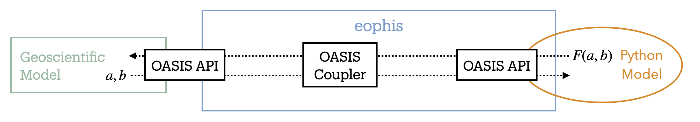
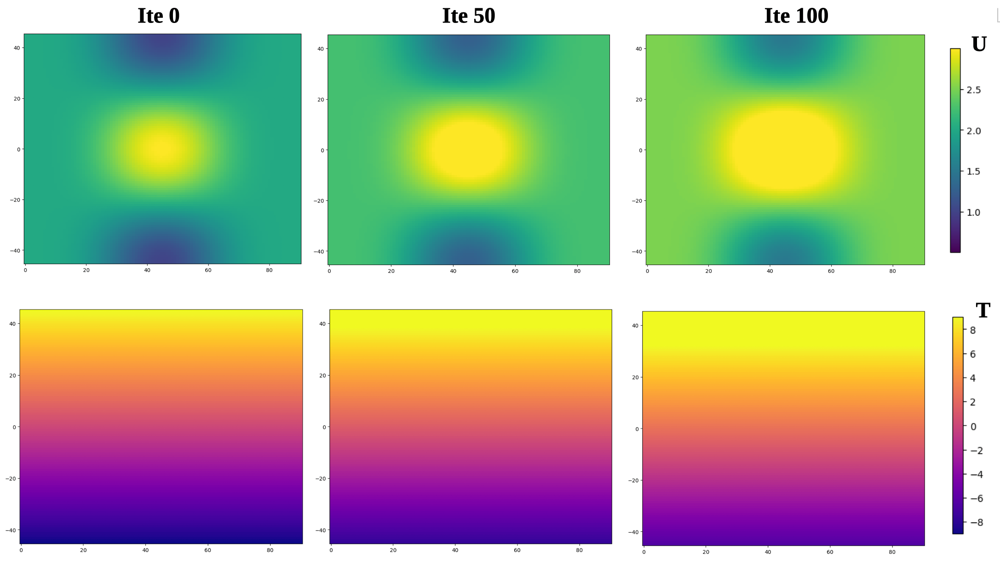

Eophis Tutorial
===============

.. toctree::
   :maxdepth: 2

In this tutorial we will build Eophis scripts to couple a Forcing Model with a geophysical code.

Prerequisites to the tutorial:
    - Installed Eophis package - we strongly recommand `installation From Container <https://eophis.readthedocs.io/en/latest/install.html#from-container>`_

Introduction
-------------

A surrogate geoscientific model "Toy Earth" with an OASIS interface is emulated by ``toy_earth_tuto.py``. It initializes three dimensionless physical 3D fields ``U``, ``V``, ``T``, discretized on metric 2D fields ``X``, ``Y`` that represent the simulated domain. The script advances in time in accordance with parameters provided in the fortran namelist ``earth_namelist_tuto`` and updates the physical fields with the following equation:

.. code-block :: bash

    A = A + dt**2 / 100. * B
    
Where ``A`` is one of the abovementioned physical fields and ``B`` a forcing term corresponding to ``A``.

The model can be executed in two distinct modes:
    - **standalone:** ``B`` is imposed with a constant value. OASIS interface is disabled.
    - **coupled:** OASIS interface is activated and Toy Earth can send the physical and metric fields through OASIS. It can also receive up to three forcing fields. If a forcing field is received, it is used instead of ``B`` for time advancement.

.. note::
    
    It is then possible to change the way the physical fields are forced. The only condition is to compute the forcing terms in an external script and to exchange results through OASIS.

Run Toy Earth
~~~~~~~~~~~~~

We start the tutorial by running Toy Earth in standalone mode. Go in tutorial directory:

.. code-block :: bash

    cd ~/eophis/tuto

Edit ``earth_namelist_tuto`` to create a domain on a ``100x100`` grid with three levels on third dimension. Set the time configuration to run the model on one hundred time steps of five seconds.

.. code-block :: bash

    vi earth_namelist_tuto
    nn_it000   =   1
    nn_itend   = 101
    # ...
    rn_Dt = 5
    nlon = 100
    nlat = 100
    nlvl = 3

Beware to keep ``ln_cpl = .false.`` to run the model lonely. Toy Earth is also able to plot the physical fields all along the run, set the output frequency as follows:

.. code-block :: bash

    vi earth_namelist_tuto
    nn_write   =  25

Now run Toy Earth:

.. code-block :: bash

    python3 ./toy_earth_tuto.py
    # NB: Toy Earth is parallelized
    mpirun -np 2 python3 ./toy_earth_tuto.py
    
    
You should find some color maps named with the following convention ``<field-name>_<output-iteration>.png``. They show the evolution of the physical fields computed by the model (first level only).
Field values slowly increase due to the uniform constant forcing term.

You can also check out content of ``earth.log``.

Run Forcing Model
~~~~~~~~~~~~~~~~~

We wish a different forcing term for ``U``. For the tutorial we will use ``dU/dX``. As described earlier, the forcing term must be computed in an external script. Edit ``models_tuto.py``, an empty function ``compute_gradient()`` is already defined. Complete content of function structure to compute the gradient of an array ``dat`` against an array ``x`` in the first dimension:

.. code-block :: python

    def compute_gradient(dat,x):
        """ Compute gradient of dat (numpy.ndarray) against x (numpy.ndarray) """
        if Is_None(dat,x):
            return None
        else:
            ddat = np.gradient(dat,axis=0)
            dx = np.gradient(x,axis=0)
            return ddat / dx

Note that in accordance with header instructions, ``compute_gradient()`` returns ``None`` if at least one of the inputs is ``None``. ``models_tuto.py`` can be executed as a standalone script. Run it to check that the Forcing Model works correctly:

.. code-block :: bash

    python3 ./models_tuto.py
    # Should print:
    #   Returned forcing shape: (50,25,10)
    #   Test successful

.. note ::

    We have now an external forcing model we wish our geoscientific code to use. However, ``models_tuto.py`` does not possess an OASIS interface and cannot be coupled with Toy Earth. In the next sections, we will build the Eophis script to set up and configure the coupling environment.

Eophis Script
-------------

Some material and information are required to set up the coupling. We will generate everything with the Eophis script ``eophis_script_tuto.py``. The script may execute ``preproduction()`` or ``production()``. The first function is used to generate coupling material. The second one contains instructions to perform the coupling itself. For both, we need to define what we want to exchange in ``toy_earth_info()``.

Defining the exchanges
~~~~~~~~~~~~~~~~~~~~~~

Toy Earth needs to send:
    - whole field ``U``, at each time step as it evolves, on 3D grid ``(100,100,3)``
    - whole field ``X``, only once as it is fixed, on 2D grid ``(100,100)``
and to receive from Forcing Model:
    - forcing field ``force_U``, at each time step, on 3D grid ``(100,100,3)``

In Eophis, exchanges are defined in Tunnel object. Define an empty Tunnel named ``TO_EARTH`` (step 1) with:

.. code-block :: python

    tunnel_config = list()
    tunnel_config.append( { 'label' : 'TO_EARTH', \
                            'grids' : {}, \
                            'exchs' : [ {} ] }
                        )

We now define the grid on which we want to perform the exchanges (i.e. Toy Earth grid):

.. code-block :: python

    tunnel_config = list()
    tunnel_config.append( { 'label' : 'TO_EARTH', \
                            'grids' : { 'grid_tuto' : {'npts' : (100,100)} }, \
                            'exchs' : [ {} ] }
                        )

What remains now is to define the exchanges themselves. Following `Tunnel documentation <https://eophis.readthedocs.io/en/latest/usage.html#tunnel>`_, we can complete exchanges definition in Tunnel for ``U``, ``force_U``, and ``X`` with:

.. code-block :: python

    tunnel_config = list()
    tunnel_config.append( { 'label' : 'TO_EARTH', \
                            'grids' : { 'grid_tuto' : {'npts' : (100,100)} }, \
                            'exchs' : [ {'freq' : 5, 'grd' : 'grid_tuto' , 'lvl' : 3, 'in' : ['U'], 'out' : ['force_U'] }, \
                                        {'freq' : Freqs.STATIC, 'grd' : 'grid_tuto' , 'lvl' : 1, 'in' : ['X'], 'out' : [] } ] }
                        )

Now that we have defined the exchanges, we can create the Tunnel object in the ``preproduction()`` function (step 4) with:

.. code-block :: python

    to_earth, = eophis.register_tunnels( tunnel_config )

Eophis is now aware of the exchanges to perform with OASIS.

Generate OASIS material
~~~~~~~~~~~~~~~~~~~~~~~

OASIS namelist can be generated with ``write_coupling_namelist()``. This function requires total simulation time as argument. This information is available from time parameters in Toy Earth namelist. Define a Fortran Namelist object (step 2) from ``earth_namelist_tuto`` with:

.. code-block :: python

    earth_nml = eophis.FortranNamelist(os.path.join(os.getcwd(),'earth_namelist_tuto'))
    
and read parameters (step 3) with:
    
.. code-block :: python

    step, it_end, it_0 = earth_nml.get('rn_Dt','nn_itend','nn_it000')
    total_time = (it_end - it_0 + 1) * step

We finally generate OASIS namelist (step 5) with:

.. code-block :: python

    eophis.write_coupling_namelist( simulation_time=total_time )

Eophis preproduction script is now ready to be executed:

.. code-block :: bash

    python3 ./eophis_script_tuto.py --exec preprod

We have generated three files: Eophis logs ``eophis.out``, ``eophis.err``, and namelist ``namcouple``. The latter is required by OASIS, do no remove it (or rerun Eophis preproduction script).

Configure Toy Earth
~~~~~~~~~~~~~~~~~~~

Now we configure coupling from Toy Earth side. Toy Earth needs to know the names under which OASIS will manipulate the variables to exchange. This information is available in ``eophis.log``:

.. code-block:: bash

    cat eophis.out
    # [...]
    ========= EOPHIS TUTO : Pre-Production =========
      Aim: write coupling namelist

    -------- Tunnel TO_EARTH registered --------
      namcouple variable names
        Earth side:
          - U -> E_OUT_0
          - force_U -> E_IN_0
          - X -> E_OUT_1
        Models side:
          - U -> M_IN_0
          - force_U -> M_OUT_0
          - X -> M_IN_1

We can see here that ``U``, ``force_U``, and ``X`` are manipulated by OASIS under ``E_OUT_0``, ``E_IN_0``, and ``E_OUT_1``, respectively. In accordance with these informations, edit ``earth_namelist_tuto`` as follows to switch Toy Earth to coupled mode:

.. code-block ::

    vi earth_namelist_tuto
    ln_cpl = .true.
    !         !  Variable name  ! couple variable (T/F) ! OASIS namcouple name ! number of levels !
    cpl_u =           'U'       ,        .true.         ,       'E_OUT_0'      ,        3
    cpl_v =           'V'       ,        .false.        ,         '...'        ,       ...
    cpl_t =           'T'       ,        .false.        ,         '...'        ,       ...
    cpl_x =           'X'       ,        .true.         ,       'E_OUT_1'      ,        1
    cpl_y =           'Y'       ,        .false.        ,         '...'        ,       ...
    ! ------- !
    cpl_force_u  =  'force_U'   ,        .true.         ,       'E_IN_0'       ,        3
    cpl_force_v  =  'force_V'   ,        .false.        ,         '...'        ,       ...
    cpl_force_t  =  'force_T'   ,        .false.        ,         '...'        ,       ...
 

Connect models
~~~~~~~~~~~~~~

We build now the ``production()`` function that will deploy the OASIS interface in ``models_tuto.py`` and drive the exchanges all along the run. With the exchanges defined in the registered Tunnel and the runtime information from the Fortran namelist, we have all the necessary material to start coupling. We can deploy the OASIS interface (step 6) using:

.. code-block :: python

    eophis.open_tunnels()

Coupling is now effective and we can perform exchanges with Tunnel. During preproduction phase, we defined a static exchange for ``X``. This means that receiving ``X`` must be performed manually before to start any time-automated exchanges. Now that OASIS is activated, we can receive ``X`` (step 7) with help of this Tunnel method:

.. code-block :: python

    x = to_earth.receive('X')

We will use ``x`` as argument for the Forcing Model. We import it (step 8):

.. code-block :: python

    from models_tuto import compute_gradient
    
    
``U`` field is still missing to call Forcing Model. During preproduction, we identified that exchanges of ``U`` and ``force_U`` should be repeated in time. Synchronization of exchanges in time is done by Loop. Loop requires a Tunnel to work with, number of time iteration, and time step value. Define Loop (step 9) as follows:

.. code-block :: python

    @eophis.all_in_all_out( geo_model=to_earth, step=step, niter=niter )

Final step is to specify connexions between the exchanged data and the Forcing Model. Edit content of ``loop_core()`` as follows:

.. code-block :: python

    def loop_core(**inputs):
        """
        Loop is defined with the decorator and time step information from 'earth_namelist_tuto'.
        Content of loop_core is the Router. Connexions between exchanged variables and models are defined here.
        inputs dictionary contains the variables that Eophis automatically received from toy_earth_tuto.py through OASIS.
        
        """
        outputs = {}
        outputs['force_U'] = compute_gradient( inputs['U'], x )
        return outputs

Note that everything is assembled here. We are now ready to run Toy Earth in coupled mode:

.. code-block :: bash

    mpirun -np 1 python3 ./toy_earth_tuto.py : -np 1 python3 ./eophis_script_tuto.py

We can see that new forcing makes ``U`` field to evolve differently in time.

Parallel execution
------------------

Tutorial grid is small. For bigger grid size, it can be necessary to share work on several processes. Good news is that Eophis is parallelized, let's give a try:

.. code-block :: python

    mpirun -np 1 python3 ./toy_earth_tuto.py : -np 5 python3 ./eophis_script_tuto.py

There is somethong wrong here: the evolution of ``U`` has deteriorated. This is because ``U`` and ``X`` fields are distributed among Eophis processes, and edge effects appear when computing the gradient near internal boundaries. The five subdomains can indeed be distinguished in the color map.

This problem could be overcome if Eophis processes had access to the values of neighboring subdomains grid cells . By default, ``numpy.gradient()`` in ``models_tuto.py`` uses first-order finite differences at the edges. In this case, just one extra cell would be sufficient.

It is possible to configure Eophis to `create extra halos cells <https://eophis.readthedocs.io/en/latest/concept_object.html#coupling>`_ when exchanging fields with coupled geophysical model. These halos cells will be available when receiving fields and ignored when sending them back. Edit ``eophis_script_tuto.py`` and adapt the grid definition in Tunnel as follows:

.. code-block :: python

    # Grid without halos
    'grids' : { 'grid_tuto' : {'npts' : (100,100)} }, \
    # New grid with halos
    'grids' : { 'grid_tuto' : {'npts' : (100,100), 'halos' : 1} }, \

We need to specify what values should contain the halo cells outside the edges of the global domain. By default, those halos are set to zero. This is a problem here because gradient at the boundary will exhibit anomalies. A better solution is to fill these extra cells as if the grid were periodic. We adapt one last time the grid definition:

.. code-block :: python

    # Periodic boundary conditions
    'grids' : { 'grid_tuto' : {'npts' : (100,100), 'halos' : 1, 'bnd' : ('cyclic','cyclic')} }, \

No need to run preproduction script again. Re-run production test case in parallel. Results should now be identical to previous section.

Going further
-------------

You have seen main Eophis features for coupling a Python script with a geophysical model. Do no hesitate to check out `concepts <https://eophis.readthedocs.io/en/latest/concepts.html>`_ and `usage <https://eophis.readthedocs.io/en/latest/usage.html>`_ sections to explore more advanced eophis functionalities. `Tests <https://eophis.readthedocs.io/en/latest/tests.html>`_ section can also provide inspiration.

Using this documentation, a good exercise would be to set up a coupling where the forcing of ``U``, ``V``, and ``T`` follows these advection equations:

.. code-block :: bash

    force_U = U * dU/dX + V * dU/dY
    force_V = U * dV/dX + V * dV/dY
    force_T = U * dT/dX + V * dT/dY
